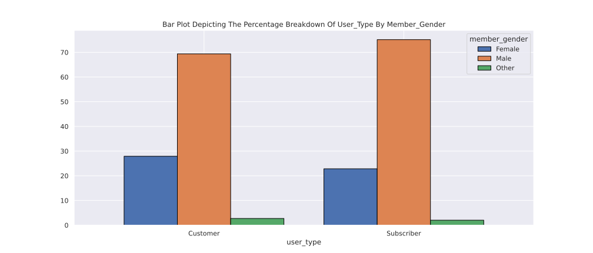

# Exploring the Usage Patterns and Demographics of Ford GoBike System Users in the San Francisco Bay Area

## Overview

This report analyzes the Ford GoBike System, a bike-sharing system in the greater San Francisco Bay area. The dataset includes 183,412 rides made by individual users, with 16 features such as duration, start and end times, start and end stations, bike ID, user type, and member demographics. 

## Key Findings

From the exploratory analysis, the following key findings were identified:

- The majority of users were subscribers, followed by customers.
- Users of age 31 took the most bike rides, followed by ages 26, 30, and 29.
- Most users did not share a bike for their trip.
- The majority of users were male, followed by female and other genders.
- Male users were the most common for both subscriber and customer user types.
- Older users (age 100+) took fewer bike rides or had difficulty reaching their destination.
- Both subscribers and customers under 80 years of age took the most bike rides.

## Insights

Based on the findings, several insights were uncovered:

- The company could focus on attracting more female users to increase ridership and profits.
- Marketing efforts could be targeted at users in their 20s and 30s, as they took the most rides.
- There could be a need for additional bikes to accommodate riders during peak hours.
- The company could create special promotions or incentives for users to encourage bike sharing.

## Libraries Used

The following Python libraries were used for the analysis:

- Pandas
- NumPy
- Matplotlib
- Seaborn

## Credits

- The data used in this file was obtained from ALX Data Analyst Nano-Degree Program

